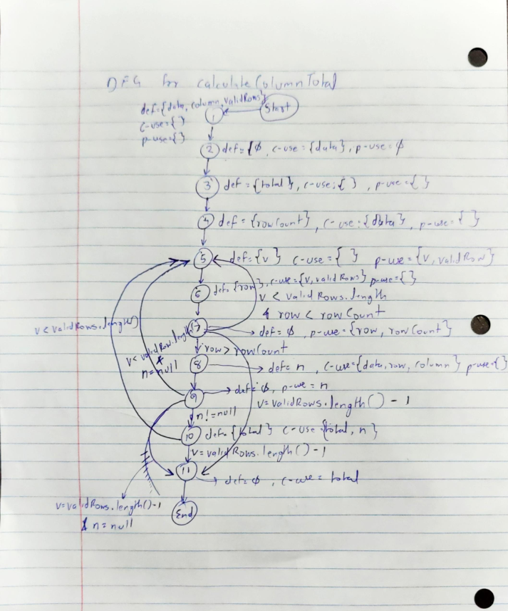
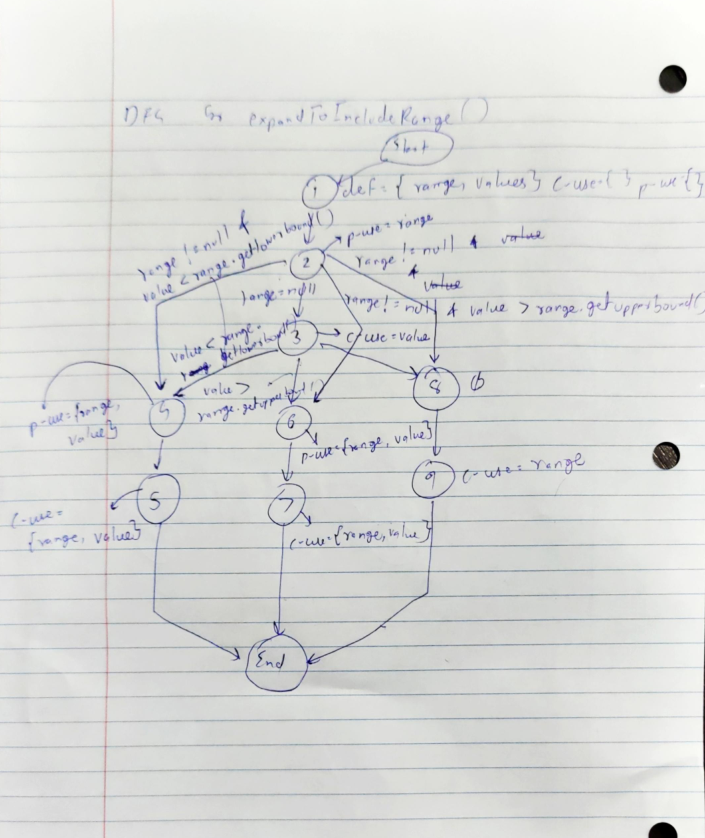
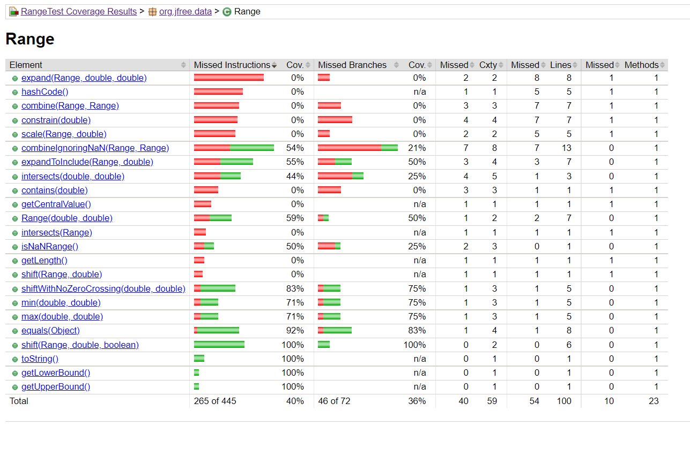
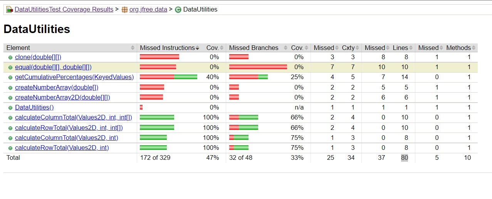

**SENG 637 - Dependability and Reliability of Software Systems**

**Lab. Report #3 – Code Coverage, Adequacy Criteria and Test Case Correlation**

| Group \#:           |G08  |
| --------------      | --- |
|Mit Patel            |30141193     |
|Dishantkumar Patel   |30136223     |
|Srujan Patel         |30130554     |
|Jairath Chopra       |30124136     |

(Note that some labs require individual reports while others require one report
for each group. Please see each lab document for details.)

# 1 Introduction

White Box Testing:
White box testing is a type of software testing that examines an application's internal code structures. Clear box testing, open box testing, structural testing, and transparent box testing are examples of this sort of testing. It is utilised at the unit, integration, and system stages of the testing process and works in the opposite direction of black-box testing.
Because of the see-through box concept, the term "Whitebox" was coined. The name "clear box" or "Whitebox" refers to the ability to see into the software's inner workings through its exterior shell (or "box"). Similarly, the "black box" in "Black Box Testing" denotes the inability to observe the software's inner workings, allowing only the end-user experience to be assessed.

The following are examples of white box testing techniques:

-	Statement Coverage — This technique uses a small number of tests to apply all programming statements.
-	Branch Coverage — In this method, all branches are tested by executing a series of tests on them.
-	Path Coverage — This technique is used to test all pathways, including statements and branches.
-	Decision Coverage
-	Condition Coverage
-	Multiple Condition Coverage
-	Finite State Machine Coverage
-	Control flow testing
-	Data flow testing

What do you verify in White Box Testing?
-	Internal flaws in security
-	Paths in the coding process that are broken or poorly structured
-	The path taken by specified inputs through the programme.
-	Expected results
-	Conditional loops are useful in a variety of situations.
-	Individualized testing of each statement, object, and function

Software development might include testing at the system, integration, and unit levels. One of the primary aims of Whitebox testing is to ensure that an application's operating flow is correct. It entails comparing a set of predetermined inputs to expected or desired outputs, with the goal of identifying bugs when one of the inputs fails to provide the expected outcome.
White box testing is a difficult task. The application being tested has a lot to do with the difficulty involved. White box testing a small application that performs a single simple task can take minutes, whereas larger programming programmes might take days, weeks, or even months to completely test.
Software testing should be performed on a software application when it is being developed, after it has been written, and again after each modification.

Advantages of White Box Testing:

-	Code optimization through the detection of hidden defects.
-	Cases for white box tests are simple to automate.
-	Because all code paths are usually covered, testing is more thorough.
-	Even if a GUI is not accessible, testing can begin early in the SDLC.

Disadvantages of White Box Testing:

-	White box testing can be time-consuming and costly.
-	It irritates developers who are used to running white box test scenarios.
-	Developers' lack of detail in white box testing can lead to production problems.
-	Professional resources with a thorough understanding of programming and implementation are required for white box testing.
-	White-box testing takes time, and larger programming applications require more time to thoroughly test.

Key Difference:

Black Box testing is performed without knowledge of the program's or application's internal structure, whereas White Box testing is performed with knowledge of the program's or application's internal structure.
When comparing Blackbox and Whitebox testing, the Black Box test does not necessitate programming skills, whereas the White Box exam does.
The primary purpose of Black Box testing is to test the behaviour of software, whereas the primary goal of White Box testing is to test the system's underlying operation.
When comparing Black Box and White Box testing, Black Box testing is more concerned with the external or end-user perspective, whereas White Box testing is more concerned with the code structure, conditions, pathways, and branching.
The Black Box test generates results with low granularity, whereas the White Box test generates reports with great detail.
When comparing Black box testing to White box testing, Black box testing takes less time, whilst White box testing takes more time.

# 2 Manual data-flow coverage calculations for X and Y methods

# 3 A detailed description of the testing strategy for the new unit test

Text…

# 4 A high level description of five selected test cases you have designed using coverage information, and how they have increased code coverage

Text…

# 5 A detailed report of the coverage achieved of each class and method (a screen shot from the code cover results in green and red color would suffice)

Text…

# 6 Pros and Cons of coverage tools used and Metrics you report

We used IntelliJ for using JaCoCo coverage tool to extract coverage information as shown below. After we set it up, we saw it provides instructions, branch, line, and method coverage. The cons for JaCoCo is that it lacks statement coverage and MC DC coverage. We then switched to Eclipse IDE and used EclEmma plugin for coverage. This tool gives you branch, instructions, line and method coverage. Both tools are similar and lacking condition coverage, so we decided to go ahead with EclEmma because it was the recommended tool.

Jacoco analysis for the Range class before writing the test suits

Jacoco analysis for the datautilities class before writing the test suits

Comparision of different Coverage Metrics:- 

Pros of statement coverage:

- It detects the statements that have been already covered. So you can easily detect if new test cases are necessary.
- It ensures if all the statements perform their task that they should ideally be performing by checking each line of the code.

Cons of statement coverage:

- There is no information about conditions. So, you can not sure what terms are covered.

Pros of branch coverage:

- This metric helps you to make sure you've iterated through every node of the tree with your test cases.
- It helps you to measure which decision outcomes have been tested (and which have not).

Cons of branch coverage:

- It is a bit complex compared to other coverage metrics. 

Pros of method/function coverage:

- Gives you an abstract view about how many methods have you covered with your test cases

Cons of method/funnctions coverage:

- There is no information about conditions. So, you can not sure what terms are covered.

# 7 A comparison on the advantages and disadvantages of requirements-based test generation and coverage-based test generation.
|     Parameter                   |     Black Box Testing                                                                                                                                   |     White Box Testing                                                                                       |
|---------------------------------|---------------------------------------------------------------------------------------------------------------------------------------------------------|-------------------------------------------------------------------------------------------------------------|
|     Definition                  |     It is a testing approach which   is used to test the software without the knowledge of the internal structure   of program or application.          |     It is a testing approach in which internal   structure is known to the tester.                          |
|     Alias                       |     It also knowns as data-driven,   box testing, data-, and functional testing.                                                                        |     It is also called structural testing, clear   box testing, code-based testing, or glass box testing.    |
|     Based of Testing            |     Testing is based on external   expectations; internal behavior of the application is unknown.                                                       |     Internal working is known, and the tester   can test accordingly.                                       |
|     Usage                       |     This type of testing is ideal   for higher levels of testing like System Testing, Acceptance testing.                                               |     Testing is best suited for a lower level of   testing like Unit Testing, Integration testing.           |
|     Programming knowledge       |     Not Needed                                                                                                                                          |     Required                                                                                                |
|     Implementation knowledge    |     Not Needed                                                                                                                                          |     Required                                                                                                |
|     Automation                  |     Tough                                                                                                                                               |     Easy                                                                                                    |
|     Objective                   |     The main objective of this   testing is to check what functionality of the system under test.                                                       |     The main objective of White Box testing is   done to check the quality of the code.                     |
|     Basis for test cases        |     Testing can start after   preparing requirement specification document.                                                                             |     Testing can start after preparing for Detail   design document.                                         |
|     Tested by                   |     User,   developer, and tester.                                                                                                                      |     Tester and   developers.                                                                                |
|     Granularity                 |     Low                                                                                                                                                 |     High                                                                                                    |
|     Testing method              |     It is based on trial-and-error   method.                                                                                                            |     Data domain and internal boundaries can be   tested.                                                    |
|     Time                        |      less   exhaustive and time-consuming.                                                                                                              |      less   exhaustive and time-consuming.                                                                  |
|     Algorithm test              |     Not the best                                                                                                                                        |     Best                                                                                                    |
|     Code Access                 |     Not required                                                                                                                                        |     Required                                                                                                |
|     Benefit                     |     Well suited and efficient for   large code segments.                                                                                                |     It allows removing the extra lines of code,   which can bring in hidden defects.                        |
|     Skill level                 |     Low skilled testers can test   the application with no knowledge of the implementation of programming   language or operating system.               |     Need an expert tester with vast experience   to perform white box testing.                              |
# 8 A discussion on how the team work/effort was divided and managed

We are four group members in this course. Firstly, we read whole assignment and discussed what should we do to complete this assignment and we all understood about different types of coverage tools. Srujan has created repository in git hub and sent invitation link to others. We shared test cases among us. Every member did one test case from Range class and one from Data Utilities Class.
# 9 Any difficulties encountered, challenges overcome, and lessons learned from performing the lab
We didn’t encounter much trouble in doing testing. Through the lab we learned how to do coverage analysis and unit testing in a structured manner and got to know how the whole process is executed by industry professionals. Setting up the project on Eclipse had caused unexpected delays in the development time due to troubleshooting minor errors related to dependencies.

# 10 Comments/feedback on the lab itself

The lab proved to be very informative exerciser in terms of an exercise that opened an opportunity for the team to be more proficient in developing test cases using Eclipse and EclEmma/JaCoCo as code coverage tool in general.